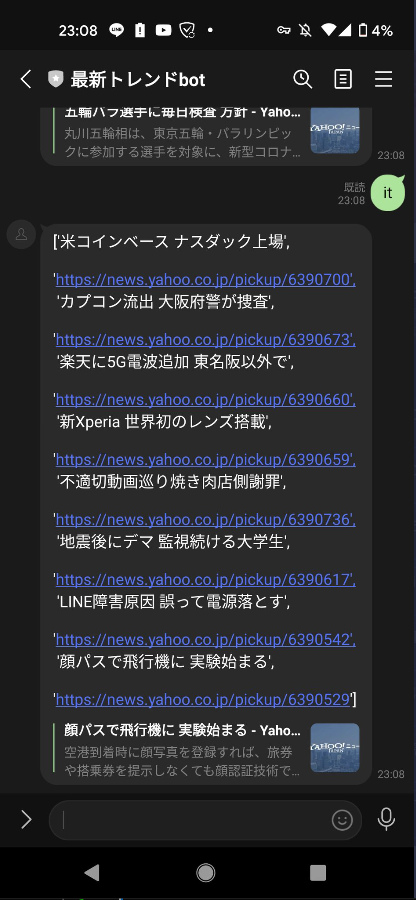
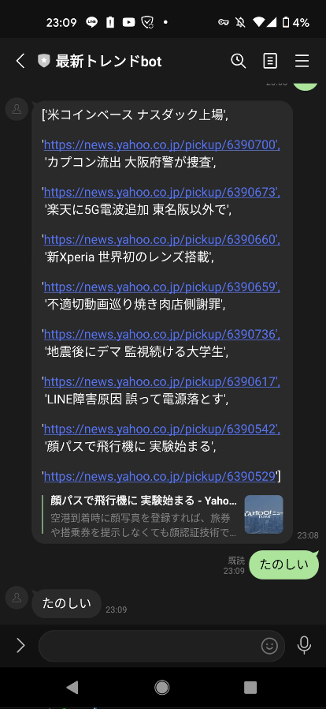

# trendaibot
トレンドやニュースをスクレイピングして、lineから入力された文言に合わせて結果を返すというbotです。

# 内容
「トレンド」と打つと現在のyahooトレンド上位を閲覧することができます。
トレンドの画像
また、国内、国際、経済、エンタメ、スポーツ、it、科学、地域と打つと、それぞれのトピックに合わせたニュースを閲覧することができます。

それ以外の文言はすべてオウム返しするように設定しています。

それぞれのファイルの説明です。
